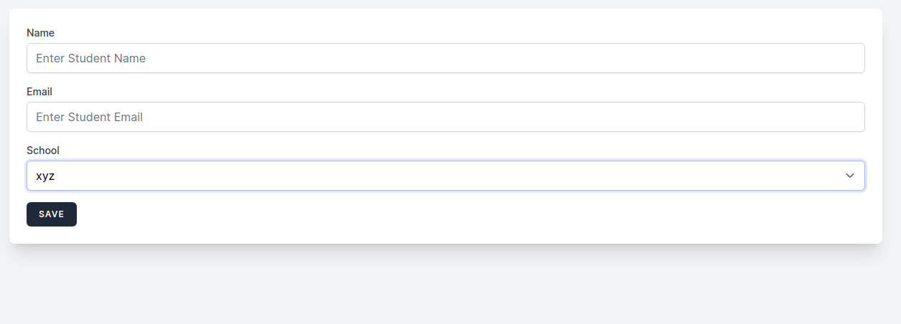

# Laravel Livewire Single Page Students CRUD System

## Requirements
1. Composer
2. PHP-8.x mysql
3. npm

## How to install

open terminal or cmd and type:

1. git clone https://github.com/tauseedzaman/Laravel-livewire-SPA-CRUD.git 
2. cd Laravel-livewire-SPA-CRUD 
3. composer install 
4. php artisan key:generate 
5. cp or copy .env.example .env

6. set up database connectivity in .env file

7. npm install
8. npm run dev
9. php artisan migrate
10. php artisan db:seed
11. php artisan serve
12. you are good to go

## Demo
  
  

## Contributing

Thank you for considering contributing to the Laravel framework! The contribution guide can be found in the [Laravel documentation](https://laravel.com/docs/contributions).

## Code of Conduct

In order to ensure that the Laravel community is welcoming to all, please review and abide by the [Code of Conduct](https://laravel.com/docs/contributions#code-of-conduct).

## Security Vulnerabilities

If you discover a security vulnerability within Laravel, please send an e-mail to Taylor Otwell via [taylor@laravel.com](mailto:taylor@laravel.com). All security vulnerabilities will be promptly addressed.

## License

The Laravel framework is open-sourced software licensed under the [MIT license](https://opensource.org/licenses/MIT).
